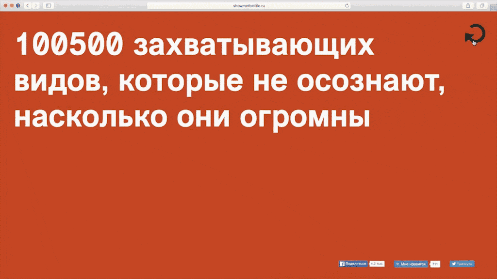

# showmethetitle.ru



Статический генератор заголовков.

Обновление 2026:
- Vite вместо legacy Gulp-сборки
- vanilla JS без jQuery и Google Analytics
- тексты в [`src/data/titles.json`](src/data/titles.json)
- адаптивная типографика с `clamp()` и дополнительным fit-проходом

Продакшен URL: <https://khabaroff.com/showmethetitle.ru/>

История проекта: <https://khabaroff.com/showmethetitle-ru/>

## Разработка

```bash
npm install
npm run dev
```

## Сборка

```bash
npm test
npm run build
```

Готовая статика собирается в `dist/`.

## Авторы

Идея и дизайн: Василий Подтынников

Верстка и программирование: Сергей Хабаров

Супервайзинг: Александр Баталов
